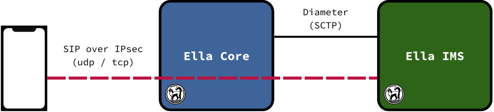

# Ella IMS (beta)

**Ella IMS** lets subscribers of a private 4G or 5G network make voice and video calls. It is an IP Multimedia Subsystem (IMS) that runs as a single application. It is designed to be easy to operate, reliable, and secure.

<p align="center">
  
</p>

> [!WARNING]
> - The API and configuration may change without notice.

## Key Features

- Voice & Video calls
- SIM-based phone authentication with your existing HSS (IMS-AKA over Cx)
- IPsec between phones and the IMS
- Voice QoS from the 4G or 5G core (PCRF over Rx, or PCF over N5 with optional mutual TLS)
- Complete IMS core in a single binary (P-CSCF, I-CSCF, S-CSCF)
- Embedded database (SQLite)
- HTTP API

## How-to Guides

### Build

#### From source

```sh
go build -o ims ./cmd/ims
```

#### Container Image

```sh
rockcraft pack
```

### Run

```sh
sudo ./ims --config ims.yaml
```

### Test

#### Unit and integration tests

```sh
go test ./...
```

The IPsec tests use network namespaces. They are skipped where those are unavailable, and fail instead when `CI` is set.

#### End-to-end tests

```sh
sudo modprobe -a sctp esp4 xfrm_user
cd e2e
E2E_RAT=4g ./up.sh
E2E_RAT=4g ./run.sh
```

`E2E_RAT` is `4g` or `5g`.

#### Fuzz tests

```sh
go test -run='^$' -fuzz='^FuzzParse$' ./sip
```

## Reference

### Configuration File

See [`ims.yaml`](ims.yaml).

### Compatibility

#### Core Networks

Ella IMS follows 3GPP standards and should connect to any compliant 4G or 5G compliant core. It has been explicitely validated against:
- Ella Core
- Open5GS


#### Phones

Ella IMS follows 3GPP standards and should connect to any compliant 4G or 5G phone. It has been explicitely validated against:
- Apple iPhone 11
- Apply iPhone 16
- Crosscall Core-Z5
- Google Pixel 10a
- Motorola Moto G 5G
- Samsung Galaxy A56

#### Phone Quirks

| Phone              | RAT | Observed                                                                           |
|--------------------|-----|------------------------------------------------------------------------------------|
| Apple iPhone 11    | 4G  | Live Voicemail answers declined and unanswered calls (`200 OK`)                    |
| Apple iPhone 16    | 4G  | Live Voicemail answers declined and unanswered calls (`200 OK`)                    |
|                    | 4G  | 3 IMS addresses in 6 minutes                                                       |
|                    | 5G  | 5G SA unavailable without SUCI on the SIM (USIM service 124, `EF.SUCI_Calc_Info`) |
|                    | 5G  | Rejects NEA0 (Security Mode Reject, cause 24)                                      |
|                    | 5G  | SIM PLMN 001/01: never attempts the 5G SA cell                                     |
|                    | 5G  | SIM PLMN 999/01: data only, no voice settings, no IMS PDU session                  |
| Motorola Moto G 5G | 5G  | SIM PLMN 999/01: 5G SA only with network type "NR only"                            |
|                    | 4G  | SIM PLMN 999/01: IMS doesn't start                                                 |
| Samsung Galaxy A56 | 4G  | SIM PLMN 001/01: VoLTE off (`LABSIM` profile, TS.43 entitlement 403)               |

## Explanation

### IPsec

Phones reach the IMS over IPsec, which the IMS sets up in the kernel. It needs `CAP_NET_ADMIN` (run as root, or add the capability to its container).

Firewalls between phones and the IMS must pass ESP (IP protocol 50).
